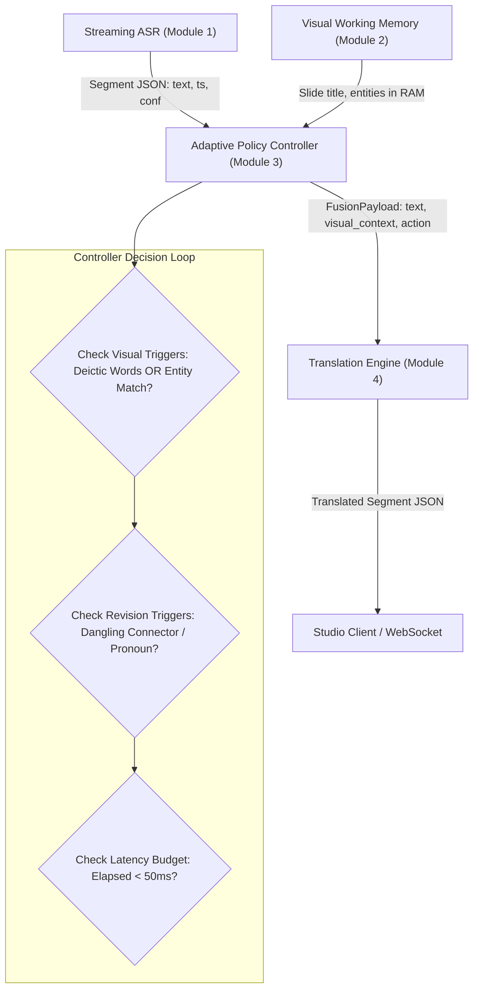

# Architectural Design Specification: Adaptive Controller & Translation Subsystems

**Date:** 2026-10-04  
**Project:** Adaptive Multimodal Online Video Translation (NCKH HUTECH)  
**Author:** Thanh (MSSV: 2380602051)  
**Supervisor:** ThS. Nguyen Dinh Anh  
**Status:** Approved  

---

## 1. Executive Summary & Problem Context
The current experimental prototype relies on hardcoded transcripts and a mock HTTP scraper for Google Translate (`translate.googleapis.com`). This violates the core scientific novelty of the project:
1. Google Translate cannot ingest structured multimodal entity prompts (*Visual Context / Fusion Prompt*).
2. The core directories `backend/controller/` and `backend/translation/` are currently empty placeholders.
3. The system requires an adaptive policy controller that selectively decides when visual evidence is necessary, detects contextual dependencies (connectors/pronouns) to revise preceding clauses, and enforces latency deadlines ($\le 1500\text{ms}$ overall, $\le 350\text{ms}$ MT).

---

## 2. Architecture & Subsystem Boundaries

### 2.1 Subsystem Map


### 2.2 Component Interfaces & Data Contracts

#### A. Input Segment Contract (from ASR)
```python
@dataclass
class ASRSegment:
    segment_id: int
    text: str
    start_time: float
    end_time: float
    confidence: float = 1.0
    is_final: bool = True
```

#### B. Visual Entity Memory Contract
```python
@dataclass
class VisualEntity:
    text: str
    score: float
    box: list[list[int]] = field(default_factory=list)
```

#### C. Fusion Context Payload (Controller -> Translation Engine)
```python
@dataclass
class TranslationRequest:
    request_id: str
    speech_text: str
    action: str  # "TRANSLATE_NOW", "REVISE_PREVIOUS", "AUDIO_ONLY_FALLBACK"
    slide_title: str = ""
    relevant_entities: list[str] = field(default_factory=list)
    previous_context: str = ""
    deadline_budget_ms: float = 350.0
```

#### D. Translation Response (Translation Engine -> Output)
```python
@dataclass
class TranslationResponse:
    request_id: str
    original_text: str
    translated_text: str
    provider: str
    latency_ms: float
    visual_grounded: bool
    is_revision: bool = False
    revised_segment_id: int | None = None
```

---

## 3. Detailed Component Design

### 3.1 `backend/translation/` (Module 4)
* **`base.py`**: Defines abstract class `BaseTranslator` with method `async translate(request: TranslationRequest) -> TranslationResponse`.
* **`prompt_builder.py`**: Builds scientific Fusion Prompt:
  ```text
  Bạn là chuyên gia dịch thuật video công nghệ Anh - Việt trực tiếp.
  [Ngữ cảnh hiển thị trên màn hình]: {slide_title} | Thuật ngữ: {entities}
  [Lời nói diễn giả]: "{speech_text}"
  Nhiệm vụ: Dịch tự nhiên sang tiếng Việt, bảo toàn nguyên vẹn tên riêng và thuật ngữ kỹ thuật.
  Bản dịch:
  ```
* **`gemini_provider.py`**: Implements `BaseTranslator` calling Gemini REST API (or fallback mock if no API key is set) with timeout management and low-latency JSON extraction.
* **`local_provider.py`**: Skeleton interface ready for loading local INT4/CTranslate2 or Transformers models on RTX 3050.
* **`factory.py`**: Factory to instantiate providers based on environment configuration (`TRANSLATION_PROVIDER=gemini|local|mock`).

### 3.2 `backend/controller/` (Module 3)
* **`state.py`**:
  - `ContextWindowManager`: Maintains a sliding buffer of the last $N=4$ translated segments.
  - `VisualMemoryCache`: Holds current slide title, active OCR entities, and indexed keywords in memory.
* **`policy.py`**:
  - `AdaptiveController`:
    - Disfluency cleaner: removes stutter like "many of you many of you" $\rightarrow$ "many of you".
    - Entity matcher: checks if words in `speech_text` overlap with `VisualMemoryCache`.
    - Deictic keyword matcher: checks for deictic markers (`this`, `that`, `table`, `chart`, `shown`, `here`, `slide`).
    - Connector matcher: checks if sentence begins with coordinating conjunctions (`and`, `but`, `so`, `because`, `which`) or relative/anaphoric pronouns (`it is`, `they are`).
    - Policy decision function:
      - If connector matched & previous segment exists $\rightarrow$ `action = "REVISE_PREVIOUS"`, merges previous English context into translation request.
      - Else if entity matched or deictic word found $\rightarrow$ `action = "TRANSLATE_NOW"` with `visual_grounded = True`.
      - Else $\rightarrow$ `action = "TRANSLATE_NOW"` with `visual_grounded = False` (Audio-Only).

---

## 4. Verification & Testing Strategy
* **Unit Tests (`tests/test_translation_engine.py`)**:
  - Verify `PromptBuilder` formats multimodal entities accurately.
  - Verify `MockTranslator` and `GeminiProvider` handle empty and non-empty contexts.
* **Controller Unit Tests (`tests/test_adaptive_controller.py`)**:
  - Verify disfluency deduplication.
  - Verify connector detection triggers `REVISE_PREVIOUS`.
  - Verify visual entity matching detects keywords like `OPENSHELL` and `DeepSeek`.
* **End-to-End Simulation Test (`tests/test_e2e_pipeline.py`)**:
  - Run the 5 Keynote sentences + Slide 120s segment through `AdaptiveController` + `TranslationEngine`.
  - Verify latency $< 500\text{ms}$ per segment and accurate terminology preservation.
