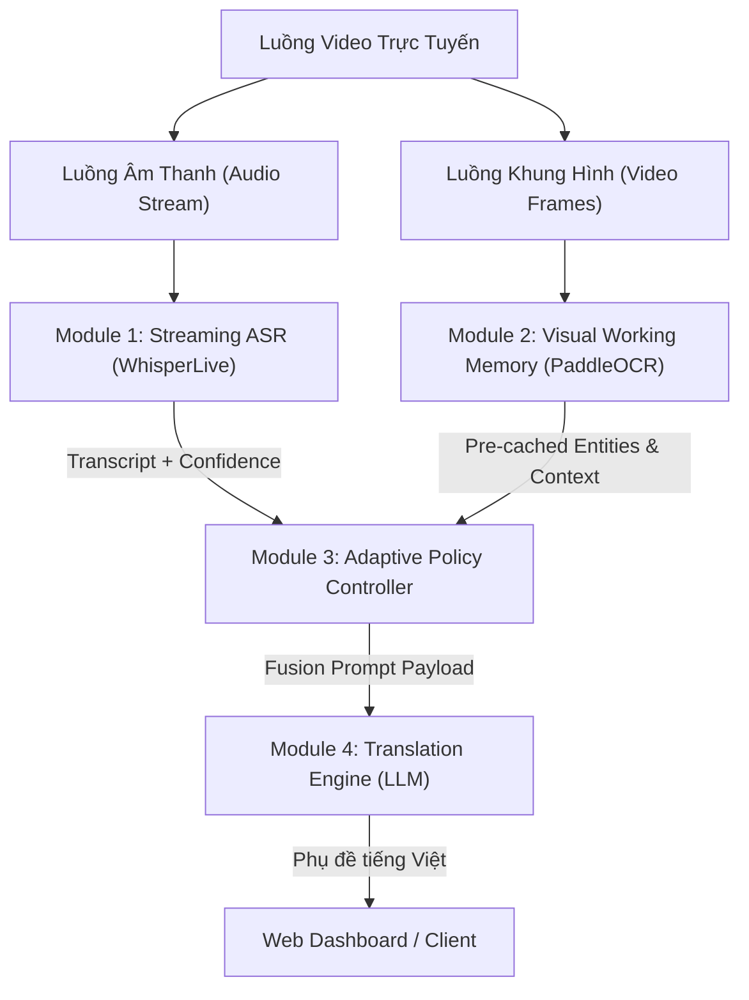

# 02. Module Interface & Data Contracts

## 1. Nguyên lý kiến trúc
Hệ thống tuân thủ nguyên tắc **Bất đồng bộ không chặn luồng (Asynchronous Non-blocking)** và **Phân tách trách nhiệm (Separation of Concerns)**. Dữ liệu trao đổi giữa các module được chuẩn hóa theo định dạng JSON chặt chẽ.



---

## 2. Đặc tả dữ liệu giữa các Module (Interface Contracts)

### Contract 1: Module 1 (Streaming ASR) $\rightarrow$ Module 3 (Controller)
* **Giao thức:** In-memory async queue / Python Asyncio.
* **Tần suất:** Mỗi khi ASR xử lý xong 1 audio chunk (mỗi 250ms–350ms).
* **Định dạng dữ liệu:**
```json
{
  "segment_id": 104,
  "timestamp_start": 42.3,
  "timestamp_end": 44.8,
  "raw_text": "As you can see in this table, the revenue reached 15 million dollars",
  "confidence": 0.93,
  "is_final": false
}
```

---

### Contract 2: Module 2 (Visual Working Memory) $\rightarrow$ Module 3 (Controller)
* **Nguyên lý:** Chạy ngầm độc lập khi phát hiện chuyển slide (`Scene_Change = True`).
* **Thời gian xử lý:** 50ms – 80ms (1 lần duy nhất cho mỗi slide).
* **Dữ liệu lưu trong RAM:**
```json
{
  "slide_id": 7,
  "detected_at_time": 41.5,
  "slide_title": "2024 Financial Performance Overview",
  "key_entities": [
    "Revenue: $15M",
    "Net Profit Margin: 25%",
    "Operating Cost: $8.5M"
  ],
  "full_ocr_text": "2024 Financial Performance Overview Revenue: $15M Net Profit Margin: 25% Operating Cost: $8.5M Key Takeaways...",
  "has_chart_or_table": true
}
```

---

### Contract 3: Module 3 (Controller) $\rightarrow$ Module 4 (Translation Engine)
* **Nguyên lý:** Controller kiểm tra điều kiện (từ chỉ định, độ bất định). Nếu phát hiện câu nói liên quan đến nội dung slide, Controller lập tức trích xuất các thực thể tương ứng từ `Visual Working Memory` để đóng gói thành **Prompt Hợp Nhất (Fusion Prompt)**:
```json
{
  "request_id": "req_104",
  "audio_text": "As you can see in this table, the revenue reached 15 million dollars",
  "visual_context": {
    "slide_title": "2024 Financial Performance Overview",
    "relevant_entities": ["Revenue: $15M", "Net Profit Margin: 25%"],
    "retrieval_latency_ms": 1.2
  },
  "deadline_budget_ms": 150
}
```

* **System Prompt mẫu nạp vào LLM Dịch:**
```text
Bạn là một chuyên gia dịch thuật video công nghệ Anh - Việt trực tiếp.
[Ngữ cảnh hiển thị trên màn hình]: Báo cáo doanh thu 2024 | Doanh thu: 15 triệu USD | Biên lợi nhuận: 25%
[Lời nói của diễn giả]: "As you can see in this table, the revenue reached 15 million dollars"

Nhiệm vụ: Dịch câu nói của diễn giả sang tiếng Việt tự nhiên, chính xác ngữ cảnh số liệu trên màn hình.
Bản dịch tiếng Việt:
```

---

### Contract 4: Module 4 (Translation Engine) $\rightarrow$ Client (Web Dashboard)
* **Giao thức:** WebSocket.
* **Thời gian đáp ứng:** < 350ms.
* **Payload gửi về trình duyệt:**
```json
{
  "segment_id": 104,
  "original_audio": "As you can see in this table, the revenue reached 15 million dollars",
  "translated_text": "Như quý vị có thể thấy trên bảng này, doanh thu đã đạt 15 triệu USD",
  "metrics": {
    "total_latency_ms": 860,
    "visual_cache_hit": true,
    "ocr_invoked": false,
    "fallback_triggered": false
  }
}
```
