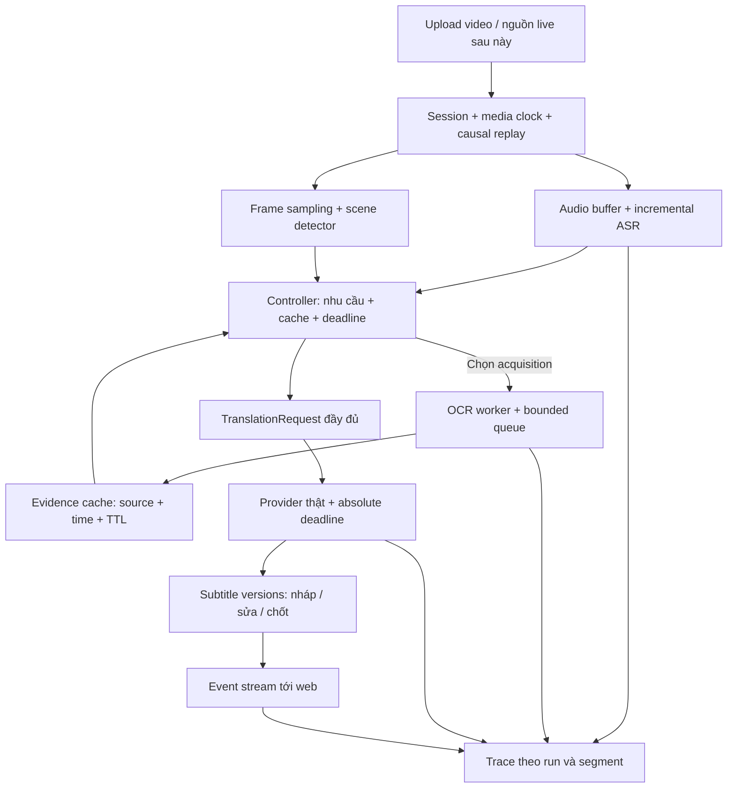

# Kế hoạch hoàn thiện sản phẩm nghiên cứu dịch video Anh–Việt

Ngày rà soát: **07/10/2026**. Đây là kế hoạch đề xuất dựa trên code và tài liệu hiện có. Lịch tám tuần giả định một người thực hiện; hạn bảo vệ và kinh phí chưa được xác nhận.

## 1. Định hướng nên chốt

Dự án đang ở giai đoạn **prototype kỹ thuật có module thật và demo xử lý trước**, chưa có bằng chứng đủ để kết luận hệ thống dịch đa phương thức thời gian thực hiệu quả hơn baseline. Nền tảng đáng giữ là faster-whisper, RapidOCR, scene detector, hợp đồng TranslationRequest, controller và giao diện song ngữ.

Sản phẩm lõi đề xuất: **website thử nghiệm phụ đề bài giảng/thuyết trình Anh–Việt, có bộ điều khiển chọn ngữ cảnh OCR theo nhu cầu và ngân sách độ trễ, đi kèm benchmark và thực nghiệm tái lập được**.

Tên nghiên cứu tạm: **Lựa chọn ngữ cảnh OCR thích ứng cho dịch phụ đề video Anh–Việt dưới ràng buộc độ trễ**. Tên này phản ánh năng lực OCR hiện có; chưa bao hàm hiểu cử chỉ, vật thể hoặc biểu đồ bằng VLM.

Câu hỏi chính: **Khi cùng dùng một ASR và engine dịch, chính sách chọn OCR dựa trên lời nói, độ mới của cache và deadline có cải thiện trade-off chất lượng–độ trễ–chi phí so với audio-only và các chính sách OCR cố định không?**

Website là công cụ chạy thử, quan sát và xuất bằng chứng. Đóng góp nghiên cứu nằm ở chính sách và thiết kế đánh giá, cần được chứng minh bằng kết quả ngoài các câu mẫu đã dùng để phát triển.

## 2. Hiện trạng theo bằng chứng

| Thành phần | Đã có | Khoảng trống ảnh hưởng nghiên cứu |
|---|---|---|
| ASR | `backend/asr/whisper_engine.py`, faster-whisper thật, word timestamps | Đọc một lát âm thanh rồi trả toàn bộ; chưa có stable partial ASR hoặc đo chờ chunk |
| OCR | `backend/vision/slide_pipeline.py`, RapidOCR thật | OCR đồng bộ; chưa có worker/queue/deadline; chưa nối frame stream của video đang upload |
| Scene detector | Histogram và pixel difference; có test | Mẫu hiện tại ít, chưa benchmark chuyển cảnh/animation/webcam trên nhiều nguồn |
| Visual cache | Index entity trong RAM | Chưa có timestamp khả dụng/TTL/source; không có `clear()` dù `LivePipelineManager.reset()` gọi nó |
| Controller | Cleaning, entity matching, từ khóa, flag revision | Chủ yếu chọn sử dụng cache; chưa thực sự quyết định lấy thêm frame/OCR theo ngân sách |
| MT providers | Mock, Gemini HTTP và local skeleton | Web dùng `fast_translate`, bỏ các trường visual/context; local chưa suy luận thật |
| Revision | Có flag và ID câu trước | Prompt dịch câu hiện tại theo ngữ cảnh; chưa trả bản sửa của câu trước hay patch đúng ID/version |
| Web | Upload, video range, timeline, đổi hiển thị baseline/adaptive | `/api/live-process` xử lý trước 35 giây; trình duyệt phát lại kết quả, chưa nhận event lúc inference |
| Telemetry | Một số timing thật, `nvidia-smi` khi có | Có số cố định 620 ms, OCR 0.02 ms, GPU fallback 233/6144 và jitter ngẫu nhiên |
| Kiểm thử | **25/25 test pass**, chạy lại ngày 07/10 | E2E MT dùng mock; chưa đo chất lượng MT thật, streaming web hoặc tính nhân quả |
| Dữ liệu | Một video trong `data/raw_videos`, vài frame; sáu câu EXP-006 | Chưa có manifest, reference độc lập, split theo nguồn hoặc dataset card |
| Tái lập | Có `.venv`, scripts, nhật ký | Chưa thấy README/lockfile/config của ứng dụng lõi ở thư mục gốc; dependency của repo tham khảo không thay thế chúng |

Phạm vi rà soát: ứng dụng lõi, test, scripts thực nghiệm và văn bản trích xuất. Các repo trong `reference_ui/` được coi là tài liệu tham khảo, chưa được audit toàn bộ. Chưa chạy trình duyệt, ASR toàn video hoặc API dịch thật trong đợt này.

Các kết quả lịch sử cần ghi đúng phạm vi:

- `results_exp006.json`: **provider mock**, sáu câu; 0.076 ms là controller, 10.6 ms là dịch giả lập. Chỉ dùng làm bằng chứng tích hợp.
- `results_exp004.json`: OCR **1933.4 ms**, vượt budget 150 ms; 0.02–0.05 ms là tra cứu RAM sau OCR. Cache giảm thời gian đọc evidence, nhưng không xóa chi phí tạo evidence.
- ASR nhanh hơn thời lượng video là tín hiệu throughput tốt; không suy ra một chunk 300 ms luôn có latency dưới 300 ms hoặc phụ đề đầu-cuối dưới 1.5 giây.
- Không cộng các số lấy từ những run khác nhau rồi gọi đó là end-to-end latency đo được.

## 3. Tài liệu nghiên cứu: giữ gì và bổ sung gì

| Tài liệu | Vai trò đối với đề tài | Hành động |
|---|---|---|
| [Attention-based Multimodal NMT, 2016](https://aclanthology.org/W16-2360/) | Nền tảng kết hợp đặc trưng ảnh và văn bản, bài toán caption translation | Dùng cho background; không coi là benchmark video live Anh–Việt |
| [STACL, 2019](https://aclanthology.org/P19-1289/) | Prefix-to-prefix và wait-k | Học cách định nghĩa đọc/ghi; dịch rời nhóm ba từ sau ASR toàn đoạn hiện tại chưa phải triển khai wait-k của bài |
| [SimulEval, 2020](https://aclanthology.org/2020.emnlp-demos.19/) | Đánh giá chất lượng cùng độ trễ dịch đồng thời | Học giao thức đầu vào tăng dần và logging; không bắt buộc tích hợp toolkit ngay |
| [DAP, arXiv 2311.17812](https://arxiv.org/abs/2311.17812) | Domain-aware prompt learning cho navigation | Rà lại trích dẫn nếu đang được dùng để nói về adaptive dịch video; có thể giữ như nguồn gián tiếp về domain adaptation |

Các nguồn trực tiếp cần bổ sung vào bảng related work:

- [Simultaneous Machine Translation with Visual Context, 2020](https://aclanthology.org/2020.emnlp-main.184/): đã nghiên cứu visual context trong simultaneous MT. Vì vậy, tính mới của dự án phải cụ thể hơn “thêm hình ảnh để dịch đồng thời”.
- [Exploiting Multimodal Reinforcement Learning for Simultaneous MT, 2021](https://aclanthology.org/2021.eacl-main.281/): đã xem xét multimodal information trong chính sách RL. Đây là nguồn cần đối chiếu khi mô tả policy.
- [Re-translation versus Streaming, 2020](https://aclanthology.org/2020.iwslt-1.27/) và [Self-training Reduces Flicker, 2023](https://aclanthology.org/2023.eacl-main.270/): relevant cho lựa chọn retranslation và đánh đổi độ ổn định của phụ đề với latency.
- [Does Vision Still Help?, 2025](https://aclanthology.org/2025.wat-1.12/): nguồn gần hơn về image selection trong multimodal translation, cần đọc kỹ trước khi chọn baseline prior work.
- [COMET, 2020](https://aclanthology.org/2020.emnlp-main.213/): nền tảng metric học từ đánh giá con người; checkpoint cụ thể cho thí nghiệm phải kiểm tra hỗ trợ Anh–Việt và điều kiện sử dụng trước khi chốt.

Đây là đối chiếu có mục tiêu, **chưa phải systematic literature review**. Tuần đầu cần lập ma trận tối thiểu các công trình sát bài toán: input speech/text, visual OCR/feature/VLM, online/offline, quyết định read/write/acquire, causal access, latency metric, cost accounting, ngôn ngữ và code. Chưa tuyên bố “đầu tiên” hay “vượt SOTA”.

## 4. Phạm vi đủ sức hoàn thành

**Bắt buộc cho bản lõi:** một cặp Anh–Việt; upload video; replay đầu vào tăng dần theo media clock; phụ đề nháp/chốt; OCR từ chính video đó; baseline/policy có cấu hình; event trace; JSONL/CSV/SRT export; dataset có reference; báo cáo so sánh.

**Sau khi lõi đạt nghiệm thu:** live microphone/tab capture; đánh giá khả dụng với người dùng; TTS giọng tiêu chuẩn. Nếu làm TTS, chỉ đọc bản đã chốt; không sửa phần âm thanh đã phát, và đo latency tới lúc bắt đầu phát giọng riêng.

**Hoãn:** voice cloning, lip-sync, RL, huấn luyện foundation model, đa ngôn ngữ, hỗ trợ mọi loại video và triển khai nhiều người dùng. Nếu đề cương đã duyệt yêu cầu dubbing, thảo luận phạm vi phụ đề + TTS tối thiểu với giảng viên; không tự coi phần bắt buộc đó đã được bỏ.

Replay video được phép biết metadata file, nhưng ASR/controller không được đọc audio/frame tương lai. Live capture là một mốc khác, cần kiểm thử riêng.

## 5. Kiến trúc mục tiêu và nguyên tắc nhân quả

Lựa chọn triển khai đề xuất: Python ASGI API, SSE cho job upload/replay; WebSocket khi cần truyền audio trực tiếp hai chiều; frontend HTML/CSS/JS hiện có có thể giữ trong vòng đầu. Chốt dependency/version sau khi kiểm tra môi trường và docs chính thức lúc triển khai. Không cần thay framework frontend để chứng minh RQ.

Mỗi session có video_id, provider, policy, cache và history riêng. Đổi video/hủy/seek phải reset trạng thái và loại event cũ. `available_at` là lúc OCR hoàn thành, khác `frame_time`. Evidence chỉ dùng khi cùng video/session, frame không ở tương lai, đã có trước quyết định và chưa hết TTL.

OCR worker có queue hữu hạn, gộp/bỏ frame lỗi thời và hủy kết quả sau deadline. ASR/MT không chờ OCR vô hạn. Cache miss dịch bằng text context; evidence đến trễ chỉ có thể dùng cho câu sau hoặc sửa phụ đề còn nháp theo protocol đã chốt.

## 6. Chính sách nghiên cứu nên bắt đầu

Giữ rule-based hiện có làm baseline. Chính sách đề xuất vòng đầu là score-based, dễ giải thích và phù hợp dữ liệu nhỏ:

`score = w1*visual_reference + w2*entity_uncertainty + w3*cache_staleness + w4*scene_change - w5*predicted_ocr_delay - w6*resource_cost`

Các tín hiệu ban đầu gồm từ chỉ màn hình, thuật ngữ chưa chắc, tuổi cache, scene-change, queue length và thời gian còn lại. ASR word probability có thể làm feature sau khi hiệu chỉnh; không gọi nó là xác suất dịch sai. Trọng số/ngưỡng chọn trên dev, khóa trước test. Nếu chưa đo quality gain thì score là heuristic, chưa phải expected Value of Information được học.

Action space đủ cho vòng đầu: `TRANSLATE_TEXT`, `USE_CACHED_OCR`, `REQUEST_OCR`, `TEXT_FALLBACK`. Revision là cơ chế riêng; giữ cùng thiết lập trong phép so sánh policy chính để tránh trộn hai đóng góp.

So sánh quan trọng nhất là với **scene-triggered proactive OCR + cùng text context**, vì đây là chính sách sát module đã có. Selective cache retrieval sau khi OCR mọi slide không đủ để chứng minh tiết kiệm acquisition.

## 7. Lịch tám tuần và các mốc nghiệm thu

Các tuần tính từ lúc bắt đầu thực hiện, không phải ngày nộp được xác nhận. Ước lượng khối lượng sẽ thay đổi theo thời gian gán nhãn và API.

| Tuần | Trọng tâm | Sản phẩm bàn giao | Điều kiện chuyển giai đoạn |
|---|---|---|---|
| 1 | Sửa đường dữ liệu; chốt RQ/phạm vi | Provider thật nhận OCR/context; bỏ telemetry giả; README/config; bảng related work | Chạy hai video khác nhau; không dùng frame ngoài session; provider lỗi không bị tính là dịch thành công |
| 2 | Streaming có nhân quả | Session/job, replay clock, ASR chunks, worker OCR, SSE, log timestamp | Event xuất hiện trước EOF; UI vẫn phản hồi; không đọc tương lai; reset/cancel/re-run sạch |
| 3 | Pilot benchmark | Đề xuất 40–60 segment từ 5–8 nguồn, guideline, reference độc lập | Audit alignment/reference; có audio-sufficient/visual-useful/visual-harmful; thống nhất nhãn |
| 4 | Benchmark và baseline | Đề xuất 200–300 segment từ 15–25 nguồn nếu khả thi; split theo nguồn; runner | Pilot cho thấy đủ nguồn/case; manifest khóa; cùng provider và context cho các arm |
| 5 | Score policy | Feature log, sweep dev, config policy khóa | Đo được số OCR giảm/không giảm và quality trade-off; không chọn ngưỡng trên test |
| 6 | Thực nghiệm chính | Run test, ablation, blinded human review, confidence intervals | Timeout/lỗi có trong kết quả; mọi bảng truy về run; phân tích theo nguồn |
| 7 | Demo sản phẩm và error analysis | Giao diện rõ nguồn evidence, export, stress run; phân tích failure cases | Đề xuất chạy liên tục 10–15 phút, không backlog tăng vô hạn; đánh giá video chưa dùng để tune |
| 8 | Đóng gói và bảo vệ | Báo cáo, figure nguồn, demo, slide, hướng dẫn tái lập, dataset card | Một người khác chạy lại trên subset; các kết luận khớp số liệu và giới hạn |

Mốc chất lượng là điều kiện kiểm chứng, không phải hứa policy sẽ thắng. Nếu sau pilot OCR không giúp trên các ca phụ thuộc slide đã xác nhận, kiểm tra alignment/prompt/OCR trước khi tăng độ phức tạp policy.

## 8. Nghiệm thu một sản phẩm nghiên cứu hoàn chỉnh

1. **Ứng dụng:** upload/replay hoạt động; phụ đề phát từ event thật; trạng thái lỗi/timeout rõ; chọn policy tạo run riêng; xem evidence đã dùng; export được.
2. **Phương pháp:** mô tả feature/action/budget/TTL; code triển khai đúng; không dùng tương lai; trọng số chỉ tune trên dev.
3. **Dữ liệu:** manifest/version/split/reference/annotation guideline; biết nguồn và quyền sử dụng; không chia clip cùng bài nói sang cả dev và test.
4. **Thực nghiệm:** có audio-context, OCR thường xuyên, scene-triggered OCR và proposed; có ablation và control evidence sai; cùng provider; báo chất lượng, latency và cost.
5. **Bằng chứng:** event trace, run config, error log, confidence intervals, output bản cuối; kết quả âm được giữ; mock tách khỏi benchmark thật.
6. **Tái lập:** dependency lock đã kiểm tra, model/checkpoint/prompt version, seed/config, lệnh chạy, sample được phép chia sẻ; có fallback demo khi mạng hỏng.
7. **Báo cáo:** RQ → protocol → bảng/figure → kết luận; ghi phạm vi Anh–Việt/slide/hardware; chưa chứng minh gì thì ghi rõ.

Các figure dự kiến: sơ đồ pipeline; quality–p95 latency; quality–OCR calls/video-minute; deadline miss/queue depth theo thời gian; nhóm lỗi OCR/ASR/context. Chỉ dựng figure kết quả khi có dữ liệu; `nature-figure` thích hợp ở giai đoạn này.

## 9. Rủi ro và cách thu hẹp

| Rủi ro | Dấu hiệu | Hành động |
|---|---|---|
| Provider chậm hơn target | p95 cao, timeout nhiều | Benchmark ngân sách 1.5/3/5 giây như sweep đề xuất trên dev; giữ cùng constraint giữa arm; không sửa mốc sau khi xem test |
| Không có ngân sách API | Không thể chạy benchmark thật | Triển khai một local provider thật và đo; hạ số arm/sample trước khi tăng scope, vẫn giữ test độc lập |
| OCR quá chậm | 1933.4 ms ở run lịch sử | Worker, resize/ROI, giới hạn queue, cache/TTL; tính cả chi phí nền khi báo tiết kiệm |
| Ít nguồn hoặc thiếu annotator | Reference một người, nhiều câu cùng keynote | Thu nhỏ tuyên bố thành pilot; ưu tiên thêm nguồn hơn thêm câu cùng video |
| Policy không hơn scene-only | Cost/quality tương đương | Báo kết quả âm và điều kiện policy có/không hữu ích; tránh thêm RL để che kết quả |
| Thời gian còn ngắn | Dưới bốn tuần | Làm phụ đề replay nhân quả + provider thật + ba baseline + pilot; bỏ TTS/live capture; gọi đúng là pilot nếu mẫu ít |

1.5 giây được coi là **target nội bộ**; cần xác định là lag từ cuối chunk/câu tới phụ đề, hay từ đầu lời nói. Không dùng cụm “chuẩn cabin quốc tế” khi chưa có nguồn kiểm chứng.

## 10. Skill đã dùng và các skill nên dùng sau

- `researchwrite`: xây scope, canon, evidence table, argument map và section contracts trước khi lập roadmap. Các file ở `research/researchwrite/adaptive-translation/`.
- `nature-statistics`: tách đơn vị nguồn video khỏi segment/repeated run, định nghĩa paired comparisons, xử lý timeout và uncertainty trong protocol. Không tạo p-value hoặc kết quả chưa đo.
- Sau khi có dữ liệu: `nature-figure` cho biểu đồ; `nature-data` cho Data/Code Availability; `nature-writing` cho manuscript; `nature-reviewer` để rà soát bản hoàn chỉnh. Chỉ áp dụng khi đến đúng bước.
- Skill Sites dành cho website do Sites quản lý; repo này đã có ứng dụng riêng nên chưa cần. Skill tạo ảnh cũng chưa giúp kiểm chứng câu hỏi nghiên cứu lúc này. Không cần cài plugin hoặc thay nền tảng để hoàn thành vòng đầu.

Đọc tiếp [protocol thực nghiệm](05_experiment_protocol.md) và [backlog triển khai](06_implementation_backlog.md). Việc đầu tiên là **nối `TranslationRequest` đầy đủ với một provider dịch thật và thêm trace có source/timestamp**, rồi mới mở rộng UI.
